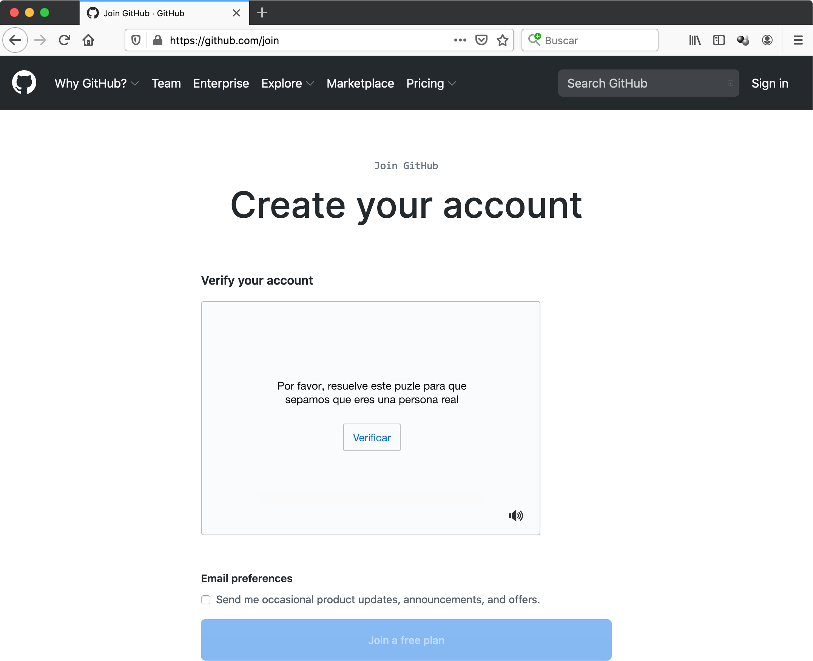
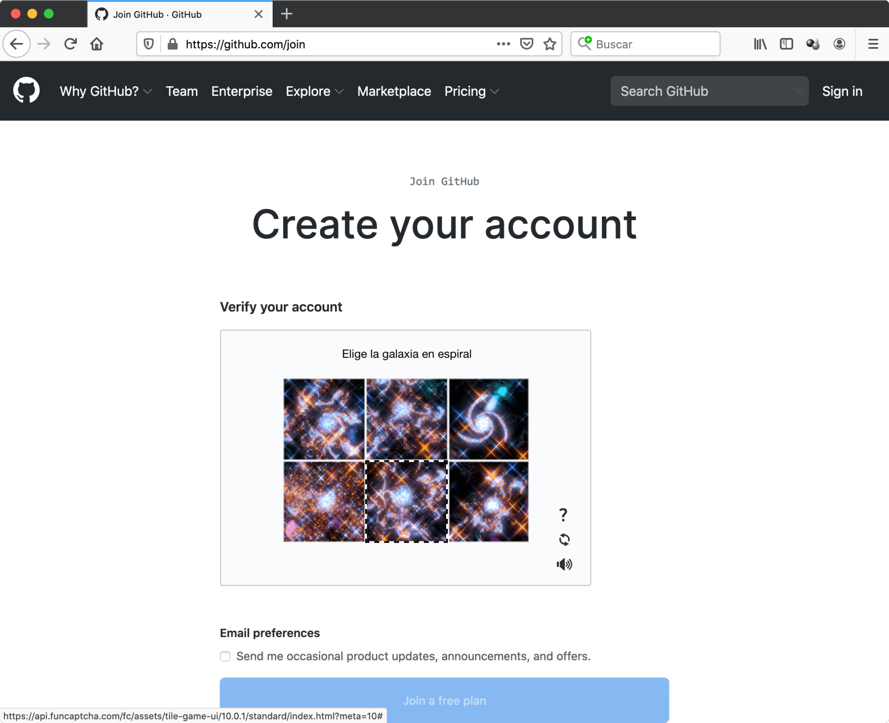
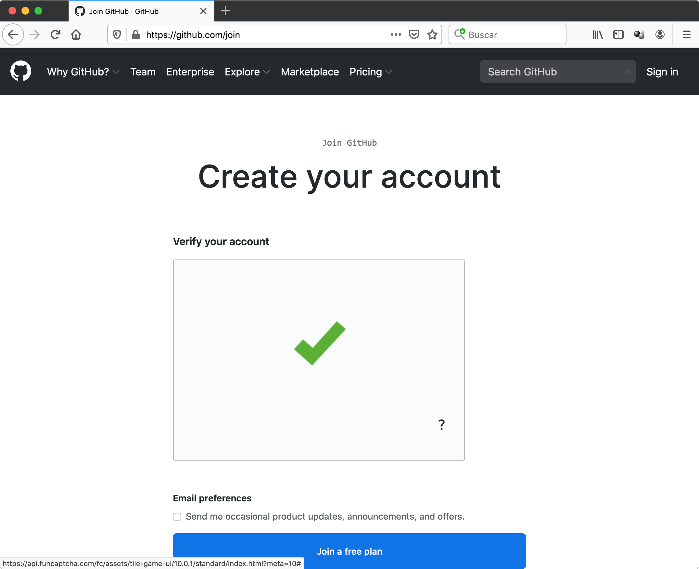
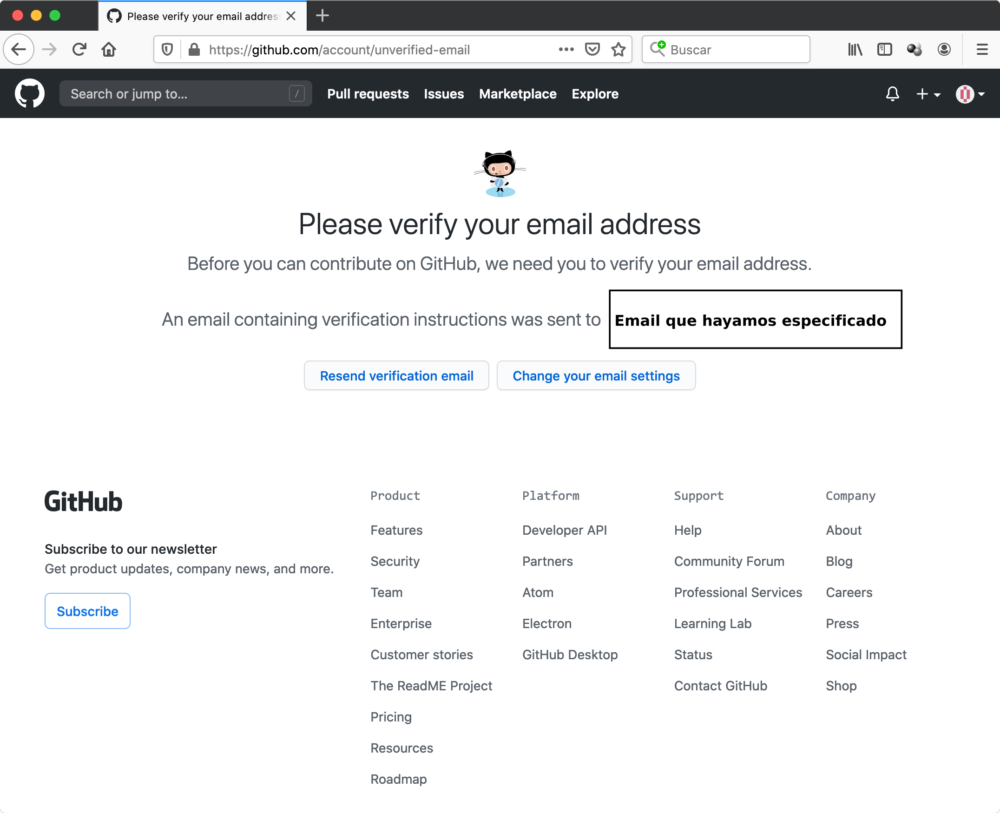
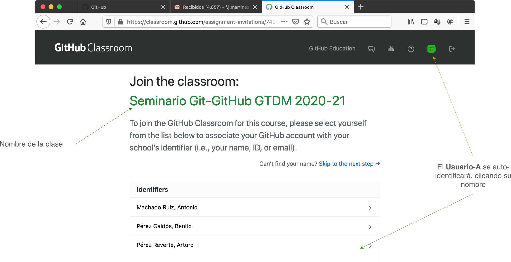
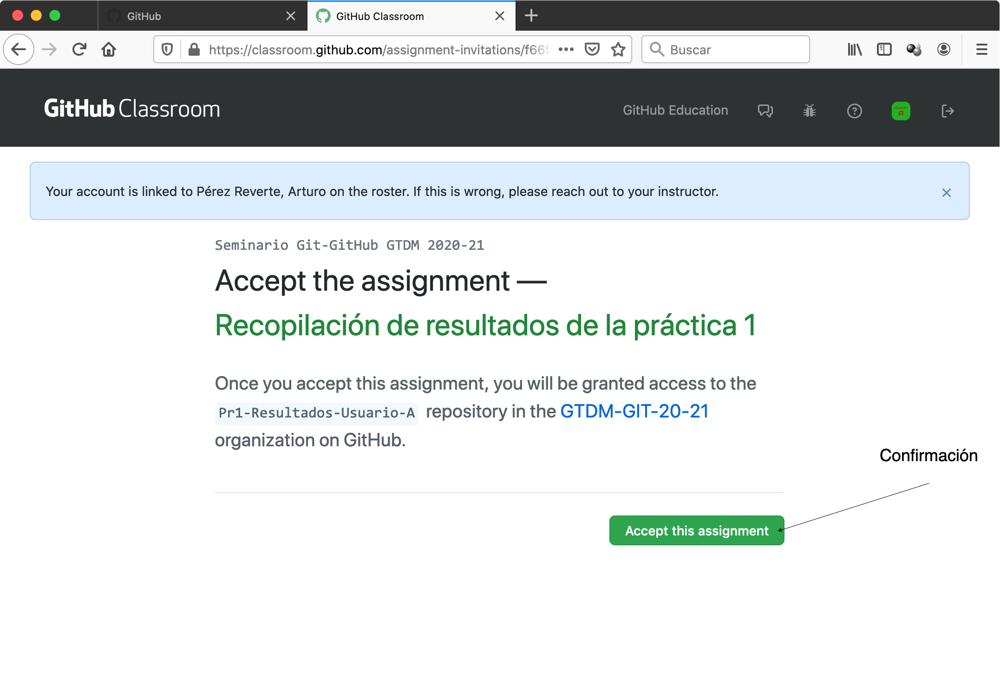
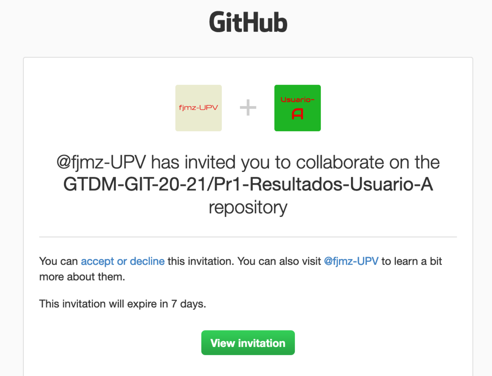

<h3 align="center">Talleres y Seminarios de Tecnologías Emergentes I</h3>


<h1 align="center">Introducción a <b>Git</b> y <b>GitHub</b></h1>


<h2 align="center">Práctica 1</h2>

<h3 align="center">Grado en Tecnología Digital y Multimedia</h3>
<h3 align="center">ETSIT-UPV</h3>


# 1. Introducción y objetivos

En el presente _Taller Seminario de Tecnologías Emergentes I_ vamos a intentar adquirir una mínima destreza con algunas herramientas tecnológicas que nos van a permitir realizar un control de versiones de nuestro software o nuestro proyecto en general. Para ello, vamos a trabajar con __Git__ y __GitHub__ y además realizaremos algunos ejercicios sencillos con la ventana en línea de comandos.


Los objetivos más importantes que nos planteamos en la presente práctica son el conseguir una mínima habilidad en el manejo de la ventana de comandos, también, el
tener una versión operativa de __Git__ instalada en la máquina de trabajo, realizando una configuración mínima pero apropiada de este software; realizaremos una primera clonación de prueba de un repositorio público y remoto; a continuación nos registraremos en __GitHub__ para tener una cuenta operativa para disponer de la posibilidad de operar en remoto con __Git__ y acceder a repositorios privados remotos, y para finalizar, clonaremos un repositorio privado y compartido con lo que denominaremos _organización_ y allí dejaremos los resultados de la presente práctica.

## 1.1. Realización de la práctica

Esta práctica es individual y se sugiere que tras una primera lectura, con la que el alumno puede hacerse una composición de lugar general de la realización de la misma, se vayan siguiendo los pasos que se van enumerando. A lo largo de esta irán apareciendo algunas cuestiones cuyas respuestas se deben ir almacenando en un fichero de texto plano. Al final se clonará un repositorio remoto privado y compartido con la _organización_ de la asignatura, donde se volcará, entre otros, dicho fichero y de esa forma se realizará la entrega efectiva de la práctica. Dentro de __GitHub__, una _organización_ es un conjunto de usuarios __GitHub__ y un conjunto de repositorios, bajo una estructura común y con ciertos criterios de permisos asignados a cada uno de los miembros según su perfil. El nombre de _nuestra_ organización es `GTDM-GIT-20-21`.  Todos estos detalles se irán relatando a lo largo del desarrollo de la práctica.

Si por algún motivo, el alumno necesitara más tiempo para finalizar  la práctica, dispondrá de 2 días hábiles adicioniales para acabar los detalles que quedaran pendientes, aunque estimamos que esta posibilidad debería ser remota.


## 1.2. Hardware y software necesario

El hardware necesario para realizar la siguiente práctica es un ordenador de cualquier arquitectura convencional: Windows, Mac OS X o Linux. Este ordenador puede ser indistintamente, un ordenador portátil personal o los ordenadores del laboratorio donde se realicen las prácticas.

Respecto al software, 
más adelante se describirá cómo realizar la descarga e instalación del software necesario para realizar esta práctica, que no es otro que `Git`. Adicionalmente, se sugiere que el alumno elija personalmente un editor de texto plano con el que se encuentre cómodo. Nosotros recomendamos alguno como `Visual Studio Code`, `Sublime Text`, `Atom`, `NotePad++`,... cuya instalación queda a discreción del alumno. 

El software que vamos a utilizar o recomendar tiene versiones en las tres arquitecturas habituales: Windows, Mac OS X y Linux, con mínimas diferencias entre ellas, por lo que resultará indiferente que un alumno trabaje con una máquina u otra.

## 1.3. Credenciales de usuario en máquinas del laboratorio

Dadas las circunstancias actuales, sería deseable, aunque no es estrictamente necesario, que cada alumno realizara la práctica en el laboratorio o aula informática con su portátil; de esa forma, toda la configuración del software a instalar se queda definitivamente hecha en su máquina personal. Si por el contrario, el alumno decide trabajar con una máquina del laboratorio o aula informática, los únicos detalles a tener en cuenta son, tras finalizar la sesión de práctias en el laboratorio, borrar sus credenciales de `github.com` en el administrador de credenciales de Windows  y realizar un _Sign out_ desde su página personal de GitHub. Estos detalles serán recordados al final de la práctica.


# 2. Manejo de la ventana de línea de comandos

La ventana de línea de comandos, consola o terminal, dependiendo del contexto, es una interfaz de tipo textual con la que el programador o usuario proporciona instrucciones al ordenador. Se la conoce abreviadamente como CLI o _Command Line Interface_. Es la forma con la que originariamente el programador se comunicaba con los ordenadores. En la actualidad, las interfaces ya no son textuales, al menos en su totalidad, sino que lo son gráficas, y son conocidas como GUI o _Graphical User Interface_. La tecnología sigue evolucionando y ya tenemos algunos ejemplos de nuevas interfaces con las que la interacción se lleva a cabo mediante el empleo de lenguaje natural, o NUI _(Natural User Interface)_. Nosotros hemos elegido la interfaz CLI por ser de momento la más eficiente y genérica transversalmente entre las distintas arquitecturas o sistemas operativos de las máquinas con las que solemos trabajar: Windows, Mac OS X y Linux.

Como comentábamos anteriormente, las ventanas del CLI suelen denominarse _terminales_ o _consolas_. En Mac OS X y Linux, los terminales tienen un comportamiento prácticamente idéntico; dentro de las mismas se ejecutan _shells_ o programas que interpretan las órdenes que el programador escribe en el terminal; algunos _shells_ típicos son por ejemplo `sh`, `bash`, `csh`, `tcsh`, `ksh`, `zsh`,... con importantes denominadores en común. En Windows, los terminales disponibles, `CMD` y `PowerShell` entre otros, contemplan unos comandos y una sintaxis completamente diferente a los _shells_ anteriores. Sin embargo, cuando se instala __Git__ (si se escoge una instalación estándar o por defecto), adicionalmente se instala un terminal de tipo _bash_ denominado `Git Bash` cuyo comportamiento es prácticamente idéntico, para nuestros efectos, al de Mac OS X y Linux. Es por ello que al ser un denominador común entre las tres plataformas más usuales, lo vamos a tomar como marco de referencia.


## 2.1. Instalación de __Git__

Vamos a realizar en este instante la instalación de __Git__ para las tres arquitecturas, y sobre todo para que las máquinas Windows dispongan de un CLI común con los CLI nativos de las máquinas Mac OS X y Linux. La configuración y uso de __Git__ se pospone para apartados posteriores.

En [https://git-scm.com/downloads](https://git-scm.com/downloads) podemos encontrar todo lo necesario para proceder con la instalación de __Git__. En esta página se puede seleccionar la versión  automáticamente propuesta por el sitio web en función de la arquitectura del ordenador con el que se está accediendo, o bien cualquiera de las mostradas: Windows, Mac OS X y Linux/Unix. Con la selección aparecen las instrucciones necesarias para proceder a una instalación estándar en cada una de las arquitecturas mostradas: se sugiere que no se modifique ninguna opción que se dé por defecto.

Existe la posiblidad de que la herramienta __Git__ esté ya instalada, lo cual es fácil comprobar: ábrase un terminal (`Git Bash` en Windows, si existe y si no una ventana `CMD` o `Powershell`) y ejecútese en cualquier directorio la orden `git --version` con lo cual, se observará en la pantalla la versión de __Git__ instalado en el caso de que efectivamente lo esté, o un mensaje de error, en el caso de que no lo esté.


---
__Ejercicio__: realícese la instalación de __Git__ en la máquina de trabajo, en caso de no estar instalada.

---


A partir de ahora, si trabajamos tanto en Mac OS X como en Linux, ejecutaremos un `Terminal` (búsquese en estas plataformas una aplicación con este nombre `Terminal` en el buscador respectivo de aplicaciones), y si estamos en Windows, un `Git Bash` (que tendremos ya disponible con un icono en el escritorio tras la instalación de __Git__, o bien pulsando el botón derecho del ratón en cualquier ventana, apareciendo como opción del menú contextual).


## 2.2. El _prompt_ y el directorio _home_

El _prompt_ del terminal es un indicador textual que nos _invita_ a introducir un comando en el terminal para que sea interpretado y ejecutado por el _shell_. Suele tener indicaciones explícitas del nombre de usuario, el directorio o _path_ en el que nos encontramos y algún símbolo separador (en nuestro caso usaremos el símbolo `$`); todas estas características dependen altamente del terminal y de cómo se haya configurado, pero muy probablemente será algo muy parecido a `usuario:~/<DIRECTORIO>$`.
La virgulilla `~` denota el directorio raíz del usuario `usuario` (también conocido como directorio _home_ del usuario), es decir, el directorio a partir del cual _cuelgan_ todos los directorios y ficheros propios y exclusivos del usuario, por lo que `usuario:~/<DIRECTORIO>$ ` denota explícitamente que `<DIRECTORIO>` _cuelga_ directamente del directorio _home_ del usuario `usuario`.
Para escribir el carácter de la virgulilla `~` en la pantalla,  se puede conseguir en una máquina Windows con `<ALT-GR>+<4>`; en Mac OS X, con `<ALT>+<Ñ>` y en Linux con cualquiera de las dos combinaciones.

El directorio _home_ del usuario, `~`, tienen referencias distintas en el sistema de ficheros en función de la plataforma o sistema operativo en el que estemos, por ejemplo:
- En Windows (PowerShell): `~ = C:\Users\usuario`
- En Windows (Git Bash): `~ = /c/Users/usuario`
- En Mac OS X: `~ = /Users/usuario`
- En Linux: `~ = /home/usuario`

De este directorio _home_ del usuario cuelgan los directorios típicos de `Documents`, `Desktop`, `Downloads`, etc. 


> Si el ordenador en el que se trabaja es Windows y pertenece al laboratorio, es probable que el directorio `~` no sea el indicado en los párrafos anteriores, sino que de alguna manera puede que esté conectado a alguna unidad de red. Compruébese ejecutando:
> ```bash
> usuario:\~$ (cd ~; pwd)
> /c/Users/usuario
> ```
> Si no se obtiene el resultado anterior (recuérdese que estamos en el supuesto de trabajar en una ventana de `Git Bash` de Windows en un ordenador de laboratorio), efectivamente, el directorio _home_ no tiene el valor esperado. Existen muchas soluciones para ello, pero vamos a optar por la más sencilla que consistirá en ejecutar lo siguiente:
> ```bash
> usuario:~$ export HOME=/c/Users/usuario
> usuario:~$ (cd ~; pwd)
> /c/Users/usuario
> ```
> (Recuérdese, en la asignación a la variable de entorno `HOME`,  sustituir `usuario` por el usuario real y no emplear ningún espacio en blanco alrededor del signo `=`.) Esto deberá hacerse cada vez que abramos una nueva ventana de `Git Bash` y deseemos que el directorio `home` o raíz del usuario tome el valor deseado.


En los siguientes subapartados veremos algunos comandos con algunas opciones. Dada la limitación de tiempo no podremos abarcar la casuística completa ni de opciones ni de comandos, por lo que se deja para el alumno que motu proprio indague en el detalle de los comandos y opciones comentados y los no comentados.

## 2.3. Los comandos `cd` y `pwd` 


El comando `cd <PATH>` (o _change directory_) cambia al directorio especificado por `<PATH>`, el cual indica de manera absoluta o relativa cómo llegar a él. En un entorno gráfico, lo podríamos traducir como cambiar a otra _carpeta_.

Si no se indica ningun directorio destino, se emplea uno por defecto: el directorio raíz o _home_ de usuario (por lo que `cd` sería equivalente a `cd ~`):

```bash
usuario:~/<DIRECTORIO>$ cd 
usuario:~$
```


El comando `pwd` _(print working directory)_ imprime en pantalla el _path_ absoluto del directorio en el que nos encontramos.

```bash
usuario:~$ pwd
/Users/usuario
```

Es decir, el directorio `~` o _home_ del usuario `usuario` (que es donde actualmente se está) es `/Users/usuario`.
O bien

```bash
usuario:~$ pwd
/home/usuario
```

O

```bash
usuario:~$ pwd
c/Users/usuario
```

dependiendo del sistema operativo.


## 2.4. Otros directorios singulares

A continuación mostramos dos directorios singulares más denominados:
- `./`: directorio __actual__, en el que se está
- `../`: directorio __padre__  del directorio actual

Así pues, si estamos en el directorio `dirAA`  (*):


```
~
└── Desktop
    ├── dirA
    │   └── dirAA (*)
    │       └── fichero1
    └── dirB (**)
        └── fichero1
```

y queremos cambiar al directorio `dirB` (**), podríamos hacerlo de la siguiente manera:

```bash
usuario:~/Desktop/dirA/dirAA$ cd ..
usuario:~/Desktop/dirA$ cd ..
usuario:~/Desktop/$ cd dirB
usuario:~/Desktop/dirB$
```

O, partiendo de nuevo de `~/Desktop/dirA/dirAA`, bien podemos hacerlo de golpe: 

```bash 
usuario:~/Desktop/dirA/dirAA$ cd ../../dirB   # Con ../ vamos al directorio padre, ~/Desktop/dirA/; con ../../, vamos al "abuelo" o padre del padre, ~/Desktop/; y de ahí ya a dirB: ~/Desktop/dirB

usuario:~/Desktop/dirB$                       # El prompt ya nos indica que estamos en ~/Desktop/dirB
```


## 2.5. Directorio de trabajo y los comandos `mkdir` y `ls`

Una de las primeras cosas que debemos hacer cuando estamos organizando los preliminares de un proyecto es elegir el directorio de trabajo, es decir la carpeta en la que vamos a incluir todos los ficheros del mismo, sea este del tipo que sea. Estamos muy habituados a hacerlo en una interfaz gráfica simplemente seleccionando alguna carpeta de referencia, navegando entre las que contiene y al final escogiendo la ubicación deseada y creando ahí una `Nueva Carpeta` a la que le cambiaremos el nombre a uno más significativo.

Una sugerencia puede ser crear la carpeta `TS1-GTDM` (por Taller Seminario 1 de GTDM) en el escritorio o _Desktop_, y en ella crear a su vez la carpeta `Practica1`. De forma relativa al directorio _raíz_ o _home_ del usuario,  podríamos ubicar las carpetas indicadas del siguiente modo:

```
~
└── Desktop
    └── TS1-GTDM
        └── Practica1
```

Es decir, el directorio _home_ `~` contiene a la carpeta `Desktop`, esta a `TS1-GTDM`y esta, a su vez, a `Practica1`.

Muy probablemente sabremos realizar estas operaciones con la interfaz gráfica, pero vamos a aprender a hacerlas con la interfaz textual o CLI. Para ello emplearemos el comando `mkdir <DIRECTORIO>` el cual crea un nuevo directorio o carpeta con el nombre indicado.
Para ello arranquemos un terminal y...

```bash
usuario:~$ cd                                   # Aunque ya estamos en el home del usuario, con este comando sin argumento nos aseguramos de ir a dicho home del usuario, estemos donde estemos

usuario:~$ cd Desktop                           # Cambiamos al escritorio

usuario:~/Desktop$ mkdir TS1-GTDM               # Con esto deberíamos observar una nueva carpeta en el escritorio con ese nombre

usuario:~/Desktop$ cd TS1-GTDM                  # Cambiamos a directorio TS1-GTDM

usuario:~/Desktop/TS1-GTDM$ mkdir Practica1     # Creamos la carpeta Practica1

usuario:~/Desktop/TS1-GTDM$ cd Practica1        # Cambiamos a la carpeta Practica1

usuario:~/Desktop/TS1-GTDM/Practica1$ pwd       # Verificamos el directorio en el que estamos
/c/Users/usuario/Desktop/TS1-GTDM/Practica1
```

(Téngase en cuenta que lo que sigue a continuación del signo `#` es un comentario y evidentemente no hay que escribirlo en la línea de comandos. Algunos comentarios son demasiado largos y probablemente ocupen más espacio que la anchura de la subventana; para poder visualizarlos, se dispone un un _scroll_ horizontal que permite mover el contenido de la subventana del código. Las líneas en blanco entre _prompt_ y _prompt_ son ficticias y se ponen para intentar clarificar el código, de modo que en función del comando pueden aparecer o no.)


---
__Ejercicio__: ábrase un _terminal/Git Bash_, ejecútense los comandos indicados anteriormente verificando gráficamente a partir del escritorio del ordenador que se han creado las carpetas indicadas. _Viájese_ por los directorios empleando el comando `cd` y utilizando algún directorio singular como `../`(por ejemplo, viaje del directorio `Practica1` a `Desktop` de manera directa, sin dar _pasos_ intermedios, después vuelva de nuevo a `Practica1` en un solo paso; luego vuelva a `Desktop` en dos pasos, pasando por tanto por `TS1-GTDM`; vuelva a `Practica1` en dos pasos...).

Tómese nota en un fichero de texto, denominado `Ejercicios.txt`, (ubicado, de momento, bajo el directorio `Practica1`) de todos los comandos que se han ido ejecutando para entregarlos como prueba documental de la realización del ejercicio, añadiendo los comentarios que al alumno le parezcan oportunos.

---


El comando `ls` _lista_ o imprime  en la pantalla un listado del contenido del directorio especificado (sus ficheros y directorios hijos). Si no se especifica ningun directorio, por defecto, lista el directorio actual. Por ejemplo:

```bash
usuario:~/Desktop/TS1-GTDM/Practica1$ cd ../../  # Cambiamos al directorio "abuelo"; también valdría ../..

usuario:~/Desktop/$ ls TS1-GTDM
Practica1

usuario:~/Desktop/$ cd TS1-GTDM 

usuario:~/Desktop/TS1-GTDM$ ls                   # sin argumento, se lista contenido del directorio actual
Practica1

usuario:~/Desktop/TS1-GTDM$ ls Practica1         # lista el contenido del directorio Practica1, que es Ejercicio.txt
Ejercicios.txt
```

Lo cual es fácilmente verificable si recordamos la estructura de directorios:


```
~
└── Desktop
    └── TS1-GTDM
        └── Practica1
            └── Ejercicios.txt
```

---
__Ejercicio__: ejecútense los comandos indicados anteriormente verificando que se obtiene los mismos resultados en la ventana de comandos.

Recuérdese añadir los comandos ejecutados en el fichero `Ejercicios.txt`.

---

## 2.6. Interacción con el interfaz gráfico del sistema operativo y los comandos `cat` y `echo`

Aunque ya se ha ido haciendo anteriormente, a continuación se propone interactuar gráficamente con la máquina, tal y como se hace habitualmente, para observar cómo realmente por detrás subyace el mismo sistema, siendo la única diferencia la forma en la que se muestra la información: bien gráfica, bien textual.

Para ello créese convencionalmente (gráficamente, es decir, boton derecho y `Nueva ventana`) una carpeta que _cuelgue_ de `Practica1` y se denomine `dir1`. A continuación, ábrase un editor gráfico de texto __plano__ (Visual Studio Code, Sublime, Atom, NotePad++, ...) y edítese un fichero con un contenido arbitrario y guárdese con el nombre `fichero1.txt` en el directorio `dir1`.

Váyase a la línea de comandos y lístese el fichero en cuestión, verificando que existe.

Hay un comando denominado `cat <FICHERO>` que escribe por pantalla el contenido del fichero <FICHERO>. Compruébese que efectivamente se muestra el contenido de dicho fichero.

Como alternativa a estos editores de texto plano basados en interacción gráfica (Visual Studio, Sublime, Atom, ...), existen editores de ficheros que trabajan en línea de comandos (por ejemplo `vi` o `vim`). Su uso es al principio más tedioso requiriendo una curva de aprendizaje costosa, pero cuando se adquiere habilidad son normalmente mucho más potentes y versátiles que los editores gráficos.


También existen formas alternativas de crear ficheros en línea de comandos, simplemente añadiendo líneas al mismo. Por ejemplo, el comando `echo` puede utilizarse para ello. Veamos todas estas ideas en los siguientes ejemplos:

```bash
usuario:~/Desktop/TS1-GTDM$ cd Practica1/dir1                                   # Se supone que dir1 fue creado desde el entorno de ventanas

usuario:~/Desktop/TS1-GTDM/Practica1/dir1$ cd ~/Desktop/TS1-GTDM/Practica1/dir1 # O bien, vamos de manera absoluta a dir1. Es equivalente, en estas circunstancias, a la instrucción anterior, pero el path es absoluto en vez de relativo

usuario:~/Desktop/TS1-GTDM/Practica1/dir1$ cat fichero1.txt                     # Se supone que fichero1.txt fue creado con un editor de texto plano
<EL CONTENIDO QUE SE HAYA ESCRITO CON EL EDITOR DE TEXTO PLANO>

usuario:~/Desktop/TS1-GTDM/Practica1/dir1$ echo "Hola" > fichero2.txt           # con >, el argumento de echo lo vuelca en un fichero nuevo (si antes existía y tenía contenido, se pierde)

usuario:~/Desktop/TS1-GTDM/Practica1/dir1$ ls                                   # lista el contenido del directorio actual
fichero2.txt

usuario:~/Desktop/TS1-GTDM/Practica1/dir1$ cat fichero2.txt                     # imprime el contenido del fichero indicado
Hola

usuario:~/Desktop/TS1-GTDM/Practica1/dir1$ echo "Adiós" >> fichero2.txt         # con >> acumula en fichero

usuario:~/Desktop/TS1-GTDM/Practica1/dir1$ cat fichero2.txt
Hola
Adiós

usuario:~/Desktop/TS1-GTDM/Practica1/dir1$ echo "Contenido nuevo" > fichero2.txt  # se crea nuevo y se pierde contenido anterior

usuario:~/Desktop/TS1-GTDM/Practica1/dir1$ cat fichero2.txt                     
Contenido nuevo

usuario:~/Desktop/TS1-GTDM/Practica1/dir1$ echo "Otro fichero" >> fichero3.txt  # >> equivale a > si fichero no existía antes

usuario:~/Desktop/TS1-GTDM/Practica1/dir1$ cat fichero3.txt
Otro fichero

usuario:~/Desktop/TS1-GTDM/Practica1/dir1$ ls                                   # se listan los ficheros del directorio actual
fichero1.txt fichero2.txt fichero3.txt
```

Ábranse con alguno de los programas gráficos de edición de texto plano anteriormente usados o citados (Visual Studio Code, Sublime Text, Atom, Notepad++, ...) todos los ficheros creados textualmente comprobando que el contenido es el que debe.

---
__Ejercicio__: síganse las indicaciones anteriores para crear los ficheros indicados tanto gráfica como textualmente, haciendo las comprobaciones que se exigen.

Añádanse los comandos y los comentarios oportunos en el fichero `Ejercicios.txt`.

---


## 2.7. Directorios ocultos

Todos los sistemas operativos que contemplamos en la práctica pueden tener directorios ocultos, es decir, directorios que _normalmente_ no son listados o visualizados y que, tal y como su calificativo indica, están ocultos, pero están ahí. El motivo por el que se ocultan suele ser para que el usuario no sea consciente de su existencia y así no interfiera en los mismos, pues pueden contener información importante o sensible para el funcionamiento de cierto software.

Hay una convención que se respeta entre todas las plataformas y es que cuando un fichero o directorio comienza por punto `.`, entonces este debe ser oculto y por lo tanto, no debe ser mostrado _normalmente_.

Como comprobaremos posteriormente, __Git__ almacena el repositorio de un directorio de trabajo en un directorio oculto dentro del propio directorio de trabajo. Este directorio oculto se denomina `.git`. Como vemos respeta el convenio de comenzar el nombre con un punto.

En muchas ocasiones, nos será necesario, o por algún motivo desearemos poder visualizar estos directorios ocultos. Esto se puede hacer fácilmente desde la línea de comandos empleando la opción `-a` del comando `ls`

```bash
usuario:~/Desktop/TS1-GTDM$ ls
Practica1

usuario:~/Desktop/TS1-GTDM$ ls -a
Practica1
```

Podemos comprobar cómo en este caso, el directorio `TS1-GTDM` __no__ contiene ningún directorio oculto (salen los mismos con la opción `-a` que sin ella); posteriormente veremos algún ejemplo con ficheros ocultos.

La forma con la que se puede mostrar un fichero oculto gráficamente en una ventana depende de la plataforma. Por ejemplo

- Windows: una opción puede ser desde el Explorador de Archivos, seleccionar la pestaña Vista y _chequear_ la opción _Elementos ocultos_ (ubicada por la derecha)

- MAC OS X: una solución puede ser `<CMD>+<SHIFT>+<.>` con la que se conmuta la visibilidad/invisibilidad de los ficheros o directorios ocultos

- Linux: `<CTRL>+<H>` con la que se conmuta la visibilidad/invisibilidad de los contenidos de la carpeta en la que se está.


## 2.8 Mover y copiar ficheros 

El comando `mv` permite cambiar la ubicación de un fichero o renombrarlo, por ejemplo:

```bash
usuario:~$ cd ~/Desktop/GTDM/Practica1/dir1 

usuario:~/Desktop/GTDM/Practica1/dir1$ ls
fichero1.txt fichero2.txt fichero3.txt

usuario:~/Desktop/GTDM/Practica1/dir1$ mv fichero1.txt fichero4.txt         # cambia el nombre de fichero1.txt a fichero2.txt

usuario:~/Desktop/GTDM/Practica1/dir1$ ls
fichero2.txt fichero3.txt fichero4.txt

usuario:~/Desktop/GTDM/Practica1/dir1$ mkdir dir2

usuario:~/Desktop/GTDM/Practica1/dir1$ ls
dir2 fichero2.txt fichero3.txt fichero4.txt

usuario:~/Desktop/GTDM/Practica1/dir1$ mv fichero2.txt dir2/fichero2.txt    # cambia la ubicación de fichero2.txt de dir1 a dir1/dir2

usuario:~/Desktop/GTDM/Practica1/dir1$ ls
dir2 fichero3.txt fichero4.txt 

usuario:~/Desktop/GTDM/Practica1/dir1$ mv fichero3.txt dir2                 # CUIDADO: segundo argumento de mv es un directorio, entonces, comportamiento especial: fichero3.txt va a dir2. Se debe ser cuidadoso con la sintaxis: experiencia

usuario:~/Desktop/GTDM/Practica1/dir1$ ls dir2
fichero2.txt fichero3.txt

usuario:~/Desktop/GTDM/Practica1/dir1$ ls
dir2 fichero4.txt

usuario:~/Desktop/GTDM/Practica1/dir1$ mv dir2/fichero3.txt .               # CUIADO: de nuevo, el segundo argumento es un directorio: el actual

usuario:~/Desktop/GTDM/Practica1/dir1$ ls
dir2 fichero3.txt fichero4.txt

usuario:~/Desktop/GTDM/Practica1/dir1$ cd dir2

usuario:~/Desktop/GTDM/Practica1/dir1/dir2$ ls
fichero2.txt
```

Téngase especial cuidado con este comando si no se tiene una mínima experiencia, por las consecuencias que puediera conllevar ya que la sintaxis puede llegar a ser crítica. Si no se conoce con detalle las consecuencias de ejecución de este comando, es preferible actuar _gráficamente_, es decir, arrastrando los ficheros de una ventana a otra.

El comando `cp` permite copiar ficheros de un origen a un destino (manteniendo, por tanto, la copia original), con consideraciones similares a `mv`.  Si continuamos desde el estado en el que nos quedamos anteriormente:

```bash
usuario:~/Desktop/GTDM/Practica1/dir1$ ls
dir2 fichero3.txt fichero4.txt 

usuario:~/Desktop/GTDM/Practica1/dir1$ cp fichero3.txt fichero5.txt

usuario:~/Desktop/GTDM/Practica1/dir1$ ls
dir2 fichero3.txt fichero4.txt fichero5.txt

usuario:~/Desktop/GTDM/Practica1/dir1$ cp fichero3.txt dir2/fichero3.txt

usuario:~/Desktop/GTDM/Practica1/dir1$ ls
dir2 fichero3.txt fichero4.txt fichero5.txt

usuario:~/Desktop/GTDM/Practica1/dir1$ ls dir2
fichero2.txt fichero3.txt                           # fichero2.txt fue "movido" en el ejemplo anterior, y fichero3.txt, "copiado" en este.
```


## 2.9. Borrado de ficheros y directorios

Evidentemente existen comandos para realizar el borrado de ficheros y directorios, pero su ejecución es potencialmente peligrosa. En caso de ser necesario borrar algún fichero o directorio, se sugiere que esto se haga gráficamente, es decir, a nivel de ventanas, ya que los sistemas operativos permitirían recuperarlo de la papelera, en caso de cometer algún error. Esto no ocurriría en línea de comandos, es decir, si ejecutamos el comando de borrado de un fichero o directorio, lo perderemos definitivamente (este comportamiento se puede modificar, pero no lo vamos a hacer por las implicaciones que puede conllevar). 

Si en algún momento nos vemos obligados a borrar un directorio o fichero oculto, evidentemente, primero deberemos hacerlo visible para a continuación borrarlo de manera gráfica o en el entorno de ventanas.


# 3. Configuración y primeros usos de __Git__

En el apartado previo ya se procedió a la instalación de __Git__. A continuación vamos a proceder a su configuración.


## 3.1. Configuración de __Git__

Vamos a mostrar dos tipos de configuraciones: una global para cualquier  repositorio que ya tengamos o vayamos a tener en el futuro en nuestra cuenta de usuario de la máquina local y otra particular para un repositorio en concreto. De esa manera podremos tener configuraciones distintas en proyectos distintos.

### 3.1.1. Configuración global de __Git__

Se sugiere que se ejecuten los siguientes comandos en una ventana de CLI (en este caso, el directorio en el que se ejecuten los mismos es  indiferente):

```bash
usuario:~$ git config --global user.name <INDICAD_VUESTRO_NOMBRE_ENTRE_COMILLAS_PARA_CONTEMPLAR_ESPACIOS>

usuario:~$ git config --global user.email <INDICAD_VUESTRO_EMAIL>

usuario:~$ git config --list          # Aparecerá un listado con todos los ítems configurados,
                                      # entre ellos, los que se han especificado: nombre y email.
                                      # Verificad que todo es correcto
```

Estos datos que se proporcionan son para poder identificar al autor de cualquier tipo de maniobra en el repositorio (tendrá sentido si en el futuro el repositorio es público y compartido).  No se hace ningún tipo de comprobación ni de uso de esta información; su intención es exclusivametne la de (auto-)identificación.

Con esto ya tenemos configurados los parámetros mínimos para que funcione __Git__. Esta configuración será la empleada en cualquier repositorio de este usuario en esta máquina, a no ser que en el repositorio en cuestión, hagamos una configuración _particular_.


#### Configuración del editor de textos

En ocasiones hay que añadir mensajes a ciertos comandos __Git__, por ejemplo, para el comando `git commit -m "Mensaje"`, como estudiaremos en sucesivas prácticas. Normalmente es muy práctico añadir mensajes breves de esta manera en la misma línea de comandos; en otras ocasiones, quizá se desee detallar mucho más un mensaje, por lo que sería más cómodo abrir _automáticamente_ un editor de textos en el que realizar esta labor. Esto se consigue omitiendo la opción `-m "Mensaje"` por lo que deberíamos escribir simplemente `git commit`, con el ejemplo citado. 

Ya hay un editor de textos configurado por defecto para que sea invocado en estas circunstancias: `vi` o `vim`. Si no se posee habilidad en el manejo de este editor de textos, puede programarse el arranque de otro alternativo al gusto del usuario. 

Vamos a dar indicaciones para configurar el editor de texto plano `Visual Studio Code` (cuyo ejecutable se denomina `code` en Mac OS X y Linux, y `Code.exe` en Windows) como editor de textos por defecto. La forma de indicar ciertos parámetros dependerá de si está disponible en el _path_ de ejecución o de su ubicación absoluta. Por ejemplo:

```bash
usuario:~$ git config --global core.editor "code --wait"                                                                        # Si está accesible vía PATH en cualquier arquitectura

usuario:~$ git config --global core.editor "'/Applications/Visual Studio Code.app/Contents/Resources/app/bin/code' --wait"      # en Mac OS X

usuario:~$ git config --global core.editor "'C:\Program Files (x86)\Microsoft VS Code\Code.exe' --wait"                         # en Windows

usuario:~$ git config --global core.editor "'C:\Users\{UserName}\AppData\Local\Programs\Microsoft VS Code\Code.exe' --wait"     # en Windows, si la instalación es local al usuario
```

Ténganse muy en cuenta las comillas dobles y simples que aparecen para que no exista ningún error en la configuración.


---
__Ejercicio__: realícese la configuración global total indicada anteriormente. 

---


Si en algún momento se desea volver al editor por defecto, la instrucción sería:

```bash
usuario:~$ git config --global --unset core.editor
```

Recuérdese que esta configuración al ser global se aplicará a todos los repositorios del usuario en cuestión. Si en algún momento deseamos desviarnos de esta configuración _global_ debemos proceder con una _local_,tal y como vamos a ver a continuación.

### 3.1.2. Configuración local o particular de __Git__

A continuación se propone que se ejecute una configuración concreta para un repositorio, es decir, una configuración _local_ o _particular_. Para ello tendremos que crearlo y después configurarlo. Vamos a crear un repositorio denominado `repo1` bajo la carpeta `Practica1` que previamente ya creamos:

```bash
usuario:~$ cd ~/Desktop/TS1-GTDM/Practica1           # Estemos donde estemos, vamos directamente al directorio Practica1 creado anteriormente

usuario:~/Desktop/TS1-GTDM/Practica1$ mkdir repo1    # Creamos el directorio o carpeta repo1

usuario:~/Desktop/TS1-GTDM/Practica1$ cd repo1       # Nos cambiamos a dicho directorio
```

Quedando como:

```
~
└── Desktop
    └── TS1-GTDM
        └── Practica1
            ├── Ejercicios.txt
            ├── dir1
            │   ├── dir2
            │   │   └── ...
            │   └── ...
            └── repo1
```

Ya tenemos entonces el directorio de trabajo creado para el ejemplo  y estamos en él. Vamos a configurar __Git__ particularmente para este directorio `repo1` (recuérdese que para una configuración local de un repositorio es necesario que este esté incializado ---con `git init`---):

```bash
usuario:~/Desktop/TS1-GTDM/Practica1/repo1$ git init
Initialized empty Git repository in /Users/usuario/Desktop/TS1-GTDM/Practica1/repo1/.git/

usuario:~/Desktop/TS1-GTDM/Practica1/repo1$ git config --local user.name <INDICAD_VUESTRO_NOMBRE_ENTRE_COMILLAS_PARA_CONTEMPLAR_ESPACIOS>

usuario:~/Desktop/TS1-GTDM/Practica1/repo1$ git config --local user.email <INDICAD_VUESTRO_EMAIL>

usuario:~/Desktop/TS1-GTDM/Practica1/repo1$ git config --local core.editor "code --wait"        # O la opción oportuna

usuario:~/Desktop/TS1-GTDM/Practica1/repo1$ git config --list
...

usuario:~/Desktop/TS1-GTDM/Practica1/repo1$ ls -a
.git
```

Obsérvese como al utilizar la opción `--local` indicamos a __Git__ que la configuración a la que estamos haciendo mención deseamos que sea exclusiva para el repositorio en el que nos encontramos.


Asimismo, podemos comprobar cómo además de los items configurados globalmente, aparecen también estos locales que prevalecen sobre los globales en este repositorio.


Independientemente de lo comentado anteriormente, podemos comprobar fácilmente cómo al inicializar un repositorio mediante el comando `git init`, automáticamente se crea el directorio oculto `.git` al observar la salida del comando `ls -a` (recuérdese que es necesaria la opción `-a` para poder visualizar además los ficheros ocultos). 

---
__Muy importante__: el contenido del directorio `.git` __jamás__ debe ser modificado, ya que, en tal caso, es muy probable que dejemos el repositorio en un estado no operativo si no conocemos suficientes detalles del sistema __Git__.

---


Se propone a continuación incializar un nuevo repositorio de una forma más directa: se denominará `repo2` y tal y como le ocurría a `repo1`, _colgará_ de `Practica1`:

```bash
usuario:~/Desktop/TS1-GTDM/Practica1/repo1$ cd ..      # Vamos al directorio padre: Practica1

usuario:~/Desktop/TS1-GTDM/Practica1$ git init repo2

usuario:~/Desktop/TS1-GTDM/Practica1$ cd repo2         # Vamos a repo2

usuario:~/Desktop/TS1-GTDM/Practica1/repo2$ 
```

De format alternativa, en vez de la secuencia anterior de instrucciones, podríamos emplear las que vienen a continuación, consiguiendo exactamente los mismos resultados (elíjase, por tanto, una secuencia u otra, no las dos):


```bash
usuario:~/Desktop/TS1-GTDM/Practica1/repo1$ cd ..      # Vamos al directorio padre: Practica1

usuario:~/Desktop/TS1-GTDM/Practica1$ mkdir repo2

usuario:~/Desktop/TS1-GTDM/Practica1$ cd repo2

usuario:~/Desktop/TS1-GTDM/Practica1/repo2$ git init

usuario:~/Desktop/TS1-GTDM/Practica1/repo2$ 
```

En este momento, deberíamos tener la presente estructura de directorios y subdirectorios:

```
~
└── Desktop
    └── TS1-GTDM
        └── Practica1
            ├── Ejercicios.txt
            ├── dir1
            │   ├── dir2
            │   │   └── ...
            │   └── ...
            ├── repo1
            │   └── .git
            └── repo2            
                └── .git             
```

---


__Ejercicio__: créese el repositorio `repo1` y configúrese tal y como se ha indicado en los párrafos anteriores. Créese también el repositorio `repo2` con las consideraciones indicadas. ¿Qué configuración aplica a `repo2`, la global o la particular especificada para `repo1`?

Recuérdese anotar los comandos ejecutados y las respuestas exigidas en el fichero `Ejercicios.txt`.

---

## 3.2. Primer ejemplo de clonación

Aunque todavía falta conocer bastantes detalles sobre la interrelación entre repositorios locales y repositorios remotos, en este momento ya podemos hacer algunas pruebas de clonación para verificar que todo funciona de la manera esperada.

Vamos a realizar una clonación de un repositorio remoto ubicado en __GitHub__ y que es __público__; el hecho de ser _público_ es el motivo por el que podemos hacer la clonación ya, sin la necesidad de tener una cuenta de usuario de __GitHub__. 
Recuérdese que la forma genérica del comando es `git clone <URL_REPOSITORIO_REMOTO> <DIRECTORIO>`.
Vamos a ver varias opciones (solo se debería ejecutar una) que proporcionan idéntico resultado, en función del valor del parámetro `<DIRECTORIO>` y del directorio desde donde se ejecuta el comando:

- Proporcionamos un directorio destino: `Prueba1` (lo hemos hecho coincidir deliberadamente con el nombre del repositorio, pero no tiene porqué ser así). Al final ejecutamos el comando `ls` para observar el contenido del directorio `Practica1`:

    ```bash
    usuario:~$ cd ~/Desktop/TS1-GTDM/Practica1    # Estemos donde estemos vamos a Practica1
    
    usuario:~/Desktop/TS1-GTDM/Practica1$ git clone https://github.com/GTDM-GIT-20-21/Prueba1 Prueba1     # Aquí <DIRECTORIO> = Prueba1
    Cloning into 'Prueba1'...
    remote: Enumerating objects: 5, done.
    remote: Counting objects: 100% (5/5), done.
    remote: Compressing objects: 100% (2/2), done.
    remote: Total 5 (delta 0), reused 5 (delta 0), pack-reused 0
    Unpacking objects: 100% (5/5), done.
    
    usuario:~/Desktop/TS1-GTDM/Practica1$ ls
    Prueba1 repo1 repo2
    ```

- O bien, no indicamos ningún directorio destino, en cuyo caso, __Git__ actúa como si le hubiéramos especificado uno con el mismo nombre que el repositorio remoto: `Prueba1`

    ```bash
    usuario:~$ cd ~/Desktop/TS1-GTDM/Practica1    # Estemos donde estemos vamos a Practica1
    
    usuario:~/Desktop/TS1-GTDM/Practica1$ git clone https://github.com/GTDM-GIT-20-21/Prueba1      # Aquí <DIRECTORIO> = NADA
    Cloning into 'Prueba1'...
    remote: Enumerating objects: 5, done.
    remote: Counting objects: 100% (5/5), done.
    remote: Compressing objects: 100% (2/2), done.
    remote: Total 5 (delta 0), reused 5 (delta 0), pack-reused 0
    Unpacking objects: 100% (5/5), done.
    
    usuario:~/Desktop/TS1-GTDM/Practica1$ ls
    Prueba1 repo1 repo2
    ```

- O bien, creamos un directorio (`Prueba1`, aunque podría haber sido cualquier otro nombre), nos introducimos en él y especificamos como directorio destino, el directorio actual (con un punto `.`):

    ```bash
    usuario:~$ cd ~/Desktop/TS1-GTDM/Practica1    # Estemos donde estemos vamos a Practica1
    
    usuario:~/Desktop/TS1-GTDM/Practica1$ mkdir Prueba1
    
    usuario:~/Desktop/TS1-GTDM/Practica1$ cd Prueba1
    
    usuario:~/Desktop/TS1-GTDM/Practica1/Prueba1$ git clone https://github.com/GTDM-GIT-20-21/Prueba1 .   #  Aquí, <DIRECTORIO> = . (directorio actual)
    Cloning into 'Prueba1'...
    remote: Enumerating objects: 5, done.
    remote: Counting objects: 100% (5/5), done.
    remote: Compressing objects: 100% (2/2), done.
    remote: Total 5 (delta 0), reused 5 (delta 0), pack-reused 0
    Unpacking objects: 100% (5/5), done.
    
    usuario:~/Desktop/TS1-GTDM/Practica1/Prueba1$ ls ../      # Obsérvese que se lista el contenido del directorio padre ../, es decir, el contenido de Practica1
    Prueba1 repo1 repo2
    ```

Recuérdese que sea cual sea la forma de llevar a cabo la clonación, el directorio destino debe estar obligatoriamente __vacío__ antes de proceder con la misma; si no es así, se producirá un error y no se llevará a cabo esta operación.

---
__Ejercicio__: escójase una de las tres formas indicadas de llevar a cabo la clonación y procédase con ella. Tanto en línea de comandos como gráficamente con ventanas, lístense todos los ficheros y directorios clonados y obsérvese su contenido en ambos casos.

Recuérdese añadir de forma oportuna, toda la información en el fichero `Ejercicios.txt`.

---


# 4. Registro de usuario en __GitHub__

A continuación procederemos a obtener una cuenta de usuario para la herramienta __GitHub__. Si algún alumno ya posee una cuenta, puede operar perfectamente con ella, pudiendo pasar directamente al apartado __4.1. Confirmación de usuario de GitHub__; en cualquier caso, téngase en cuenta la consideración del correo electrónico que a continuación comentaremos, por lo que se sugiere que al menos lea el contenido del presente apartado, aunque no lleve a cabo ninguna operación.


Tal y como hemos visto en teoría, __GitHub__, desde cierto punto de vista, podemos considerarlo como un conjunto de repositorios _remotos_ ubicados en un sitio web, en el cual podremos copiar el contenido de nuestros repositorios _locales_; asimismo, podemos aprovechar esta circunstancia para así compartir nuestros proyectos con otras personas (todo el mundo o algunas en particular) y recibir sugerencias o ayuda en el desarrollo de los mismos.


El registro es muy sencillo. Previamente hay que tener decidido algunos detalles:
- Un nombre de usuario y alguno o algunos más, por si ya existiera el que hemos elegido.
- Una dirección de correo electrónico. En esto hay plena libertad, aunque se sugiere que sea la de la universidad, ya que habrán notificaciones que se envíen, en un caso al correo de la universidad y en otro al especificado en GitHub: si coinciden no habrá problemas; si no, habrá que mirar en ambas cuentas de correo o tenerlas centralizadas, para estar completamente informado.
- La contraseña

Ábrase la página web [https://github.com](https://github.com), eligiendo la opción __Sign up__,  e introdúzcanse estos datos, tras lo cual se mostrará la ventana de la derecha:


<p align="center">
 &nbsp; &nbsp;

</p>

Al clicar en `Verificar` aparecerá un _acertijo_ gráfico que hay que responder.  Si se acierta, se muestra la confirmación en la misma ventana (ventana de la derecha).


<p align="center">
 &nbsp; &nbsp;

</p>

Clicaremos en el botón `Join a free plan` y pasaremos a la siguiente ventana en la que se nos pregunta por nuestro perfil, tal y como muestra la siguiente ventana,  pasando a continuación a la de la derecha:

<p align="center">
 &nbsp; &nbsp;

</p>


La cual nos indica que miremos en el email especificado, buscando un correo de confirmación de dirección. Lo buscamos, clicamos en el _link_ de dicho correo donde se nos pide la confirmación y nos aparecerá la siguiente ventana. 
En ella podremos elegir entre algunas de las tres opciones principales, o simplemente saltarlas e ir directamente a nuestra cuenta de usuario de GitHub clicando `Skip this for now`, con lo que aparece definitivamente la ventana de la derecha:


<p align="center">
 &nbsp; &nbsp;

</p>


Llegados a este punto, ya tenemos creado nuestro usuario de GitHub con el que trabajaremos en subsiguientes prácticas.


## 4.1. Confirmación de usuario de GitHub y compartición de respositorio

A continuación se va a proceder a asociar vuestro nombre personal con vuestro usuario de GitHub. 

Una vez llegados a este punto y __no antes__, y teniendo abierta la sesión en __GitHub__ con su cuenta personal, se clicará el enlace proporcionado en un email enviado desde la cuenta de uno de los profesores de la asignatura y con asunto __Identificacion usuario GitHub__, con el que cada alumno se auto-identificará clicando su nombre de una lista que aparece en el enlace, tal y como se muestra a continuación (el ejemplo se da para un supuesto usuario de GitHub denominado `Usuario-A`):

<p align="center"></p>


(Se debería ser cuidadoso con el clicado para no elegir un nombre que no seal el que le corresponde, ya que esto provocaría ciertos errores tediosos de corregir en el futuro: si esto ocurriera, contáctese con alguno de los profesores para enmendarlo cuanto antes. Si por el contrario, no aparece en la lista, clíquese el enlace `Skip to the next step` y comuníquelo inmediatamente al profesor; esto no impedirá el transcurso normal de la práctica, pero provocará errores de identificación futuros, por lo que habrá que solventarlo cuanto antes.)

A continuación se aceptará la realización de un supuesto ejercicio y de cualquier autorización de acceso por parte de __GitHub Classroom__ (producto de __GitHub__ asociado a entornos académicos, que es el que estamos utilzando). Es probable que en paralelo se reciba un email de confirmación con un enlace, como el que aparece a continuación a la derecha, pero en principio no será necesario usarlo...

<p align="center">


</p>


ya que desde el propio navegador en el que hemos abierto el enlace original ya tendremos accesible un repositorio con nombre `GTDM-GIT-20-21/Pr1-Resultados-<NOMBRE_DEL_USARIO_DE_GITHUB>` desde el propio sitio web de GitHub en nuestra cuenta de usuario:

<p align="center"></p>


Al aceptar el ejercicio, se crea y se comparte automáticamente el repositorio privado con el alumno con la intención de  ser el _repositorio_ de los resultados de la presente práctica. Esto se ha hecho así para que esta práctica pueda tener un carácter público (de esta forma no hacía falta ni tener un usuario de __GitHub__ ni petenecer a la organización `GTDM-GIT-20-21` en el principio de la práctica), y los resultados ya se puedan entregar de forma privada y unipersonal.


A continuación clónese en local de la siguiente manera:

```bash
usuario:~$ cd ~/Desktop/TS1-GTDM

usuario:~$ git clone https://github.com/GTDM-GIT-20-21/Pr1-Resultados-<NOMBRE_DEL_USARIO_DE_GITHUB>
```

En este momento, muy probablemente se pedirá un usuario y contraseña de __GitHub__. 
Esta autenticación es completamente independiente de la que se hace en el navegador cuando se accede al sitio web de __GitHub__.
Dependiendo del sistema operativo, esta petición se hará de una manera gráfica o textual. Una vez introducida ya no se volverá a pedir. En el caso de querer cambiar la autenticación, deberán eliminarse las credenciales de autenticación para que las vuelva a pedir.

Al no especificar `<DIRECTORIO>` en el comando `git clone` entonces automáticamente se crea uno con el mismo nombre que el repositorio (`Pr1-Resultados-<NOMBRE_DEL_USARIO_DE_GITHUB>`) y ahí se vuelca todo el repositorio y directorio de trabajo, tal y como se podrá observar.

Como habrá podido apreciar el alumno, acaba de descargarse el repositorio cuya intención es asociarlo a la resolución de ejercicios de la Práctica 1, denominado `Pr1-Resultados-<NOMBRE_DEL_USARIO_DE_GITHUB>`. Tiene una importante diferencia respecto al de la práctica 1 y es que el alumno se habrá percatado que ha hecho falta autenticarse frente a GitHub para poder descargarlo, cosa que no ocurrió con la actual práctica ubicada en un repositorio público. El motivo es que el repositorio `Pr1-Resultados-<NOMBRE_DEL_USARIO_DE_GITHUB>` es privado y solo puede tener acceso el profesor de la asignatura y el alumno en cuestión; hay por tanto, tantos repositorios privados _replicados_ e _individuales_ como alumnos.


# 5. Resultados a entregar

Tómese nota de todos los comandos que se han ido ejecutando, su funcionalidad, detalles, comentarios y repóndase a las cuestiones que han ido apareciendo a lo largo de la presente práctica en el fichero `Ejercicios.txt`.

Cópiese del directorio `Practica1` el fichero `Ejercicios.txt` y el directorio `dir1` en el directorio `Pr1-Resultados-<NOMBRE_DEL_USARIO_DE_GITHUB>`
(hágase gráficamente, simplemente copiando los fichero de la ventana origen a la destino):

```
(Antes de la copia)
~
└── Desktop
    └── TS1-GTDM
        ├── Practica1
        │   ├── Ejercicios.txt 
        │   ├── dir1
        │   │   ├── dir2
        │   │   │   └── ...
        │   │   └── ...
        │   ├── repo1
        │   │   └── .git
        │   ├── repo2            
        │   │   └── .git        
        │   └── Prueba1
        │       └── ...        
        └── Pr1-Resultados-<NOMBRE_DEL_USARIO_DE_GITHUB>
            ├── .git
            └── README.md
```

```
(Después de la copia)
~
└── Desktop
    └── TS1-GTDM
        ├── Practica1
        │   ├── Ejercicios.txt 
        │   ├── dir1
        │   │   ├── dir2
        │   │   │   └── ...
        │   │   └── ...
        │   ├── repo1
        │   │   └── .git
        │   ├── repo2            
        │   │   └── .git        
        │   └── Prueba1
        │       └── ...        
        └── Pr1-Resultados-<NOMBRE_DEL_USARIO_DE_GITHUB>
            ├── .git
            ├── README.md            
            ├── Ejercicios.txt 
            └── dir1
                ├── dir2
                │   └── ...
                └── ...
                        
```


Ubíquese en el directorio `Pr1-Resultados-<NOMBRE_DEL_USARIO_DE_GITHUB>` y ejecútense allí los comandos __Git__:

```bash
# Vamos al directorio "Pr1-Resultados-<NOMBRE_DEL_USARIO_DE_GITHUB>"
usuario:~$ cd ~/Desktop/TS1-GTDM/Pr1-Resultados-<NOMBRE_DEL_USARIO_DE_GITHUB>

# Llevamos todos los ficheros del directorio de trabajo al "index"
usuario:~/Desktop/TS1-GTDM/Pr1-Resultados-<NOMBRE_DEL_USARIO_DE_GITHUB>$ git add -A

# Del index a un commit del repositorio
usuario:~/Desktop/TS1-GTDM/Pr1-Resultados-<NOMBRE_DEL_USARIO_DE_GITHUB>$ git commit -m "Carga de resultados de la Práctica 1"

# Subida a remoto GitHub
usuario:~/Desktop/TS1-GTDM/Pr1-Resultados-<NOMBRE_DEL_USARIO_DE_GITHUB>$ git push origin master  # no sería necesario añadir los parametros origin y master, ya que tras la clonación, la rama master lo es con seguimiento
```

Con estas operaciones (que serán detalladas y explicadas en la siguiente práctica), subiremos todos los ficheros y directorios creados en la presente práctica al repositorio remoto preparado para recoger los resultados y allí quedarán almacenados definitivamente para su evaluación.

Síganse todas estas indicaciones con la máxima fidelidad, para evitar una merma en la calificación.

## 5.1. Credenciales de Windows y _Sign out_ de <b>GitHub</b>

Al finalizar la sesión de prácticas, solo si la máquina en la que se ha realizado la práctica es una máquina del laboratorio y por tanto y en principio con sistema operativo Windows, recuérdese tomar la precaución de borrar las credenciales de __GitHub__ en el _Administrador de credenciales_ de Windows y concretamente en las _credenciales de Windows_. Asimismo, se sugiere que se realice una operación de _Sign out_ en el navegador desde la página web personal de __GitHub__ seleccionándolo desde logo de usuario en la esquina superior derecha de dicha página web.


